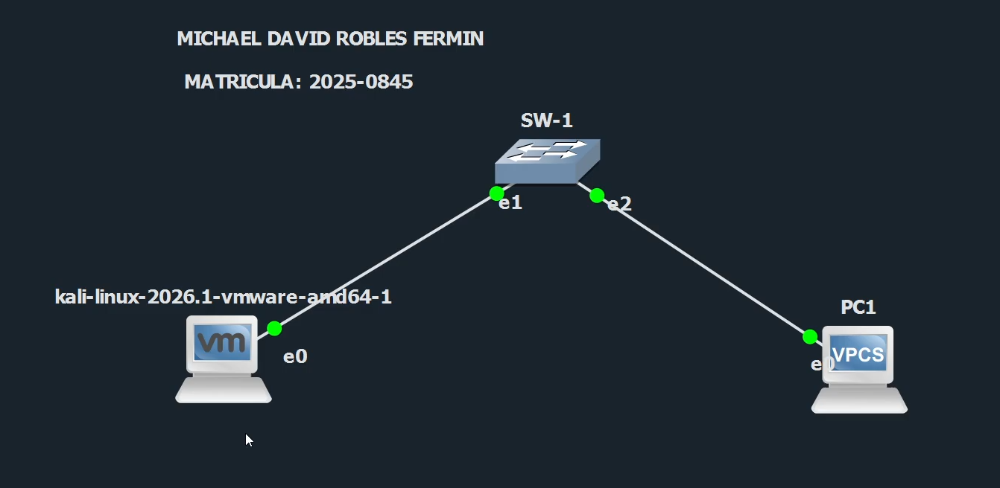
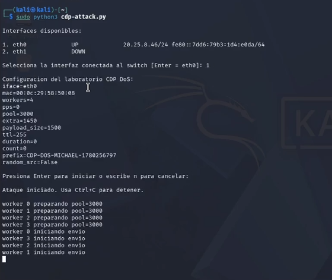
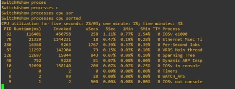
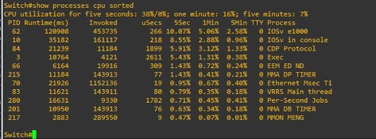
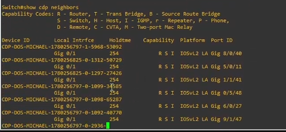
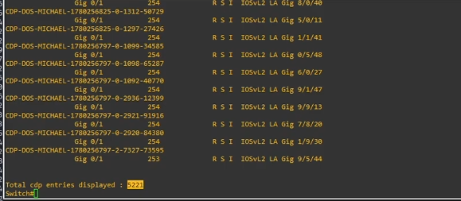
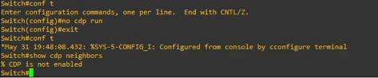
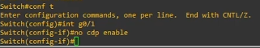

# Ataque DoS mediante CDP – Guía How-to

## Introducción

En este repositorio se demuestra un ataque de **Denegación de Servicio (DoS)** mediante el protocolo **Cisco Discovery Protocol (CDP)** dentro de un entorno de laboratorio controlado. El propósito es mostrar cómo un atacante puede abusar de CDP enviando una gran cantidad de paquetes CDP hacia un switch, provocando aumento en el uso de CPU y posible degradación del rendimiento de la red.

Esta guía explica cómo preparar el laboratorio, ejecutar el script de ataque, observar su impacto y aplicar las técnicas de mitigación correspondientes.

**Uso responsable:**
Este proyecto es únicamente para fines educativos, académicos y de investigación. Los scripts deben ejecutarse solo en entornos de laboratorio donde tengas autorización. No utilices estas técnicas en redes de producción ni en redes de terceros.

## Requisitos previos

* Un laboratorio en GNS3 o un entorno de virtualización similar.
* Imágenes de switch Cisco IOSvL2 y router Cisco con CDP habilitado.
* Una máquina virtual Kali Linux como atacante, con Python 3 instalado.
* Un equipo víctima, por ejemplo VPCS o Linux.
* Red base `20.25.8.0/24` configurada en todos los dispositivos.
* Privilegios de root o sudo en la máquina atacante.
* Repositorio clonado [`iClexi/CDP-Attack`](https://github.com/iClexi/CDP-Attack).

A continuación se muestra la topología utilizada en este laboratorio:



| Dispositivo         | Interfaz     | Dirección IP    | Rol              |
| ------------------- | ------------ | --------------- | ---------------- |
| **R-1 (Router)**    | F0/0         | `20.25.8.45/24` | Gateway          |
| **SW-1 (Switch)**   | Gi0/1, Gi0/2 | —               | Switch de capa 2 |
| **Kali (Atacante)** | eth0         | `20.25.8.46/24` | Atacante         |
| **PC1 (Víctima)**   | —            | `20.25.8.47/24` | Víctima          |

Antes de ejecutar el ataque, asegúrate de que exista conectividad básica entre el atacante, la víctima y el router. Por ejemplo, desde PC1 puedes probar:

```text
ping 20.25.8.45
```

## Instalación y preparación

1. **Clonar el repositorio:**

```bash
git clone https://github.com/iClexi/CDP-Attack.git
cd CDP-Attack
```

2. **Instalar dependencias en Kali:**

```bash
sudo apt update
sudo apt install python3 python3-pip
pip3 install scapy
```

3. **Configurar los dispositivos de red:**

* Habilitar CDP en el switch y el router, que normalmente viene activo por defecto.
* Asignar las direcciones IP mostradas en la topología.
* Verificar conectividad desde PC1 hacia el router con:

```text
ping 20.25.8.45
```

## Ejecución del ataque

El script de ataque es `cdp-attack.py`. Este envía ráfagas de paquetes CDP con tamaño de payload, pool y cantidad de workers configurables. Los parámetros pueden ajustarse según los recursos disponibles en el laboratorio.

**Comando de ejemplo:**

```bash
sudo python3 cdp-attack.py -i eth0 --yes \
  --workers 4 \
  --pool 3000 \
  --payload-size 1500 \
  --extra 1400 \
  --duration 60
```

* `-i eth0`: interfaz conectada al switch.
* `--workers`: cantidad de procesos paralelos. Por defecto usa la cantidad de CPU detectada.
* `--pool`: cantidad de paquetes pre-generados por cada worker.
* `--payload-size`: tamaño de cada paquete CDP. Máximo recomendado: 1500 bytes.
* `--extra`: bytes adicionales agregados al TLV de descripción de software.
* `--duration`: duración del ataque en segundos. Si es `0`, corre sin límite.
* `--yes`: omite la confirmación interactiva.

Durante el ataque, el script muestra estadísticas sobre los paquetes enviados y el promedio de paquetes por segundo.



## Observación del impacto

En el switch, se debe monitorear el uso de CPU y los vecinos CDP para observar el efecto del ataque.

### Uso de CPU antes del ataque

```text
SW1# show processes cpu sorted
```



### Uso de CPU durante el ataque

```text
SW1# show processes cpu sorted
```



En esta etapa se observa cómo aumenta el uso de CPU cuando se envía el flood de paquetes CDP.

### Vecinos CDP después del flood

Ejecutar:

```text
SW1# show cdp neighbors
```

Se deben observar cientos o miles de entradas CDP falsas aprendidas desde el puerto del atacante:



El script también muestra la cantidad de entradas CDP desplegadas, por ejemplo:



Estas entradas confirman el efecto del flood sobre el switch.

## Técnicas de mitigación

Existen dos mitigaciones principales para detener ataques DoS basados en CDP.

### 1. Deshabilitar CDP globalmente

Si CDP no es necesario en el dispositivo, puede deshabilitarse completamente:

```text
SW1(config)# no cdp run
SW1# show cdp neighbors
% CDP is not enabled
```



Esto evita que el dispositivo procese paquetes CDP.

### 2. Deshabilitar CDP en interfaces no confiables

Si CDP es necesario en puertos de administración o enlaces controlados, pero no en puertos de usuario, puede deshabilitarse por interfaz:

```text
SW1(config)# interface gigabitEthernet0/1
SW1(config-if)# no cdp enable
SW1# show cdp neighbors
% CDP is not enabled
```



Esta configuración detiene el procesamiento de CDP solamente en la interfaz especificada, dejando CDP activo en las demás interfaces donde sea necesario.

Después de aplicar la mitigación, se debe repetir el ataque y verificar que la CPU se mantenga baja y que los vecinos CDP no aumenten.

## Conclusión

Esta guía demuestra cómo un atacante puede abusar de **Cisco Discovery Protocol (CDP)** enviando paquetes CDP manipulados hacia un switch para consumir recursos de CPU y generar múltiples entradas falsas de vecinos CDP.

Siguiendo los pasos anteriores, es posible reproducir el ataque dentro de un laboratorio controlado y observar su impacto técnico. La mitigación recomendada consiste en deshabilitar CDP globalmente cuando no sea necesario, o deshabilitarlo únicamente en puertos no confiables o de usuario mediante `no cdp enable`.

Para más detalles sobre los parámetros del script, notas técnicas y solución de problemas, consulta el archivo `mitigacion-cdp-attack.md` incluido en este repositorio y el video original del laboratorio.
